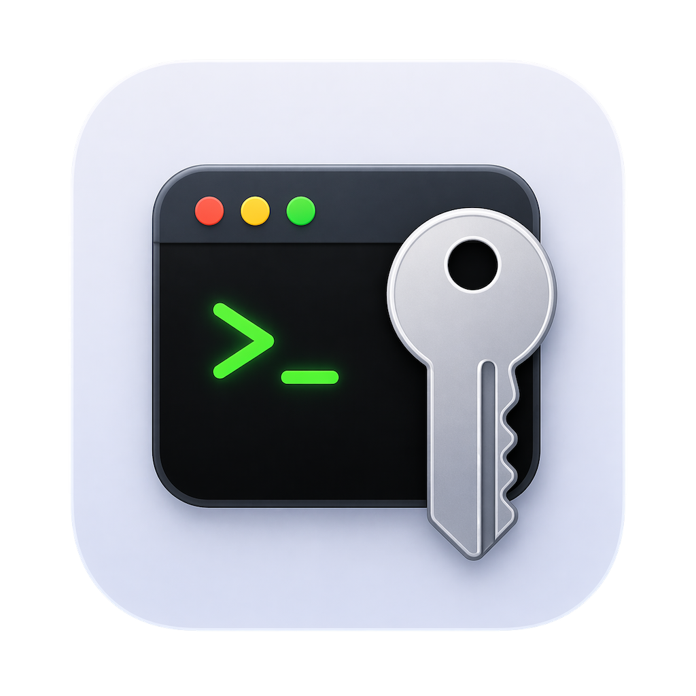
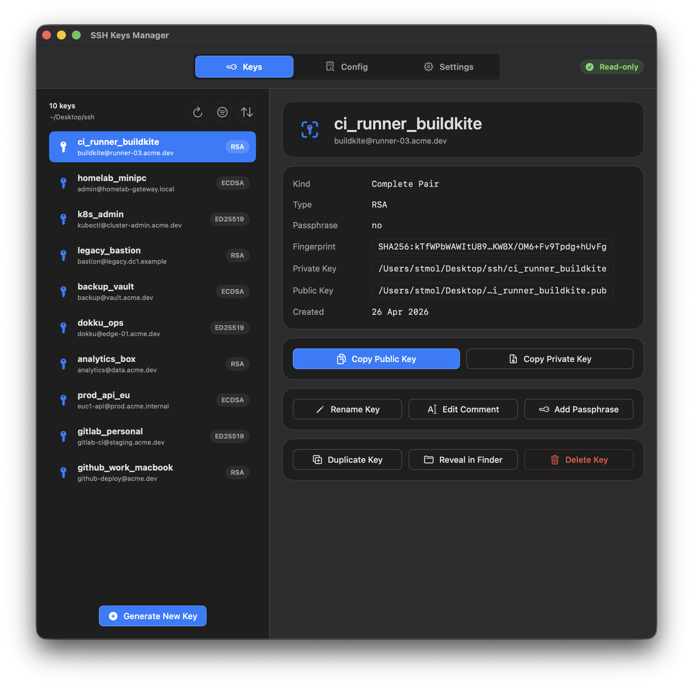
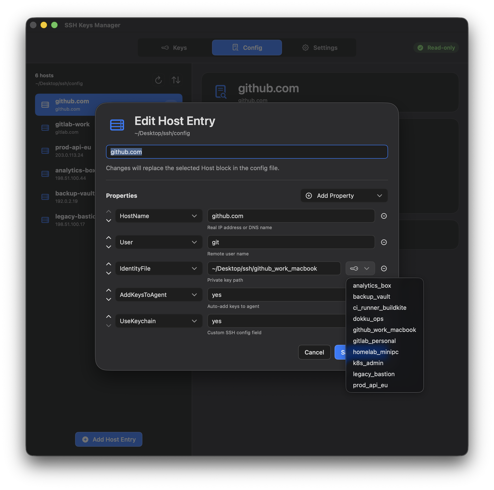
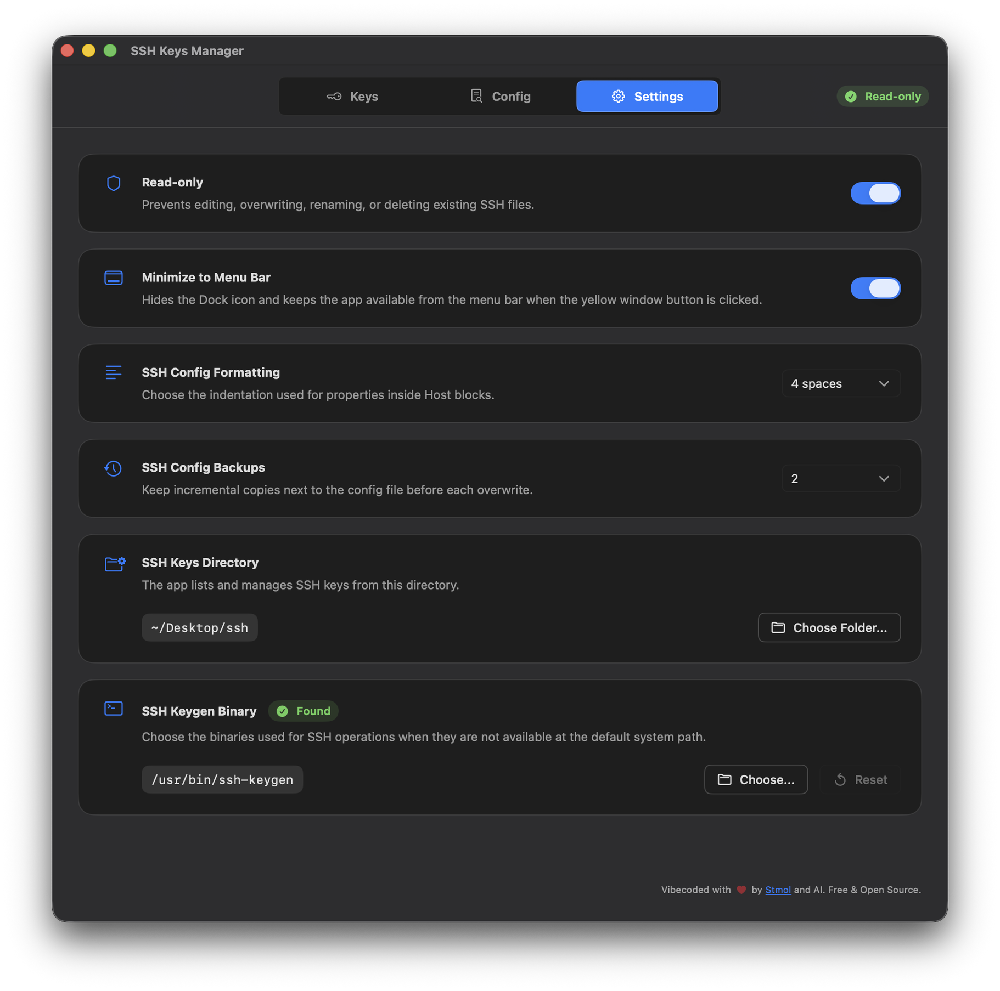

<a id="readme-top"></a>

<div align="center">



</div>

<h1 align="center">SSH Keys Manager</h1>

<div align="center">

Native macOS app for browsing, copying, generating, and organizing SSH keys and SSH config entries.

</div>



## Table of Contents

<ol>
  <li><a href="#about-the-project">About The Project</a></li>
  <li><a href="#download">Download</a></li>
  <li><a href="#features">Features</a></li>
  <li><a href="#ai-assisted-development">AI-Assisted Development</a></li>
  <li><a href="#build-from-source">Build From Source</a></li>
  <li><a href="#license">License</a></li>
</ol>

## About The Project

**SSH Keys Manager** is a native macOS application focused on one job: making local SSH key management easier and safer.

It gives you a clean interface for working with private and public key files, reviewing SSH config entries, assigning `IdentityFile` values, and maintaining a local SSH workspace without dropping into a terminal for every routine change.

The app works with the default `~/.ssh` directory, but it can also point to a custom SSH workspace if you keep your keys somewhere else.

<p align="right"><a href="#readme-top">Back to top</a></p>

## Download

You can download a ready-to-run build from the project's [GitHub Releases](../../releases) page.

<p align="right"><a href="#readme-top">Back to top</a></p>

## Features

### SSH Key Workspace

Browse keys from `~/.ssh` or from a custom directory, inspect metadata, and keep related files in one place.

### Generate, Rename, Duplicate, and Remove Keys

Create new key pairs with a selected filename, key type, comment, and optional passphrase. You can also rename existing keys, duplicate them, update comments, change passphrases, and remove files you no longer need.

### SSH Config Editing

Create, edit, reorder, and delete `Host` blocks from your SSH config with a native form-based editor. The app also helps map hosts to available private keys through `IdentityFile` selection.



### Menu Bar Access

The app includes a menu bar interface for quick access to your SSH keys. You can copy public and private keys directly from the menu bar without switching back to the main app window.

### Read-Only Safety Mode

For extra safety, the app includes a **Read-only** mode.

When enabled, it blocks operations that would modify existing SSH files, including editing, overwriting, renaming, and deleting. This is especially useful if you want to inspect and copy keys without risking accidental changes to a working SSH setup.



### Native macOS Experience

Built with Swift and SwiftUI, the app is designed to feel like a regular Mac utility instead of a wrapped web tool. It supports a menu bar workflow and a dedicated settings screen for SSH directory selection, config backup behavior, external tool paths, and safety controls.

<p align="right"><a href="#readme-top">Back to top</a></p>

## AI-Assisted Development

> [!IMPORTANT]
> This project was created with significant AI assistance, and that is intentional and transparent.
>
> Parts of the codebase were generated with AI, but the application was not shipped as unchecked output. The generated code was reviewed, corrected, and validated by a human developer before being kept in the project.
>
> That review process matters, but the app also includes an additional safety layer: **Read-only mode**. Even if you simply want to audit your SSH workspace and avoid all risk of modifying important files, the app can be switched into a mode that prevents destructive or file-changing operations.

<p align="right"><a href="#readme-top">Back to top</a></p>

## Build From Source

You can build the app yourself from source by cloning the repository.

### Option 1: Open in Xcode

```bash
git clone https://github.com/Stmol/ssh-keys-manager-macos-app.git
cd ssh-keys-manager
open "SSH Keys Manager.xcodeproj"
```

Then build and run the `SSH Keys Manager` scheme from Xcode.

### Option 2: Build a Release DMG from the command line

The repository includes a release packaging pipeline that builds an unsigned macOS release and produces a DMG locally.

```bash
git clone https://github.com/Stmol/ssh-keys-manager-macos-app.git
cd ssh-keys-manager
make release-dmg VERSION=v0.1.0
```

Or build the full set of release assets:

```bash
make release-assets VERSION=v0.1.0
```

This produces:

- `dist/SSH-Keys-Manager-v0.1.0.dmg`
- `dist/SSH-Keys-Manager.dmg`
- `dist/SSH-Keys-Manager-v0.1.0-dSYMs.zip`

<p align="right"><a href="#readme-top">Back to top</a></p>

## License

This project is licensed under the MIT License. See the [LICENSE](LICENSE) file for details.

<p align="right"><a href="#readme-top">Back to top</a></p>
